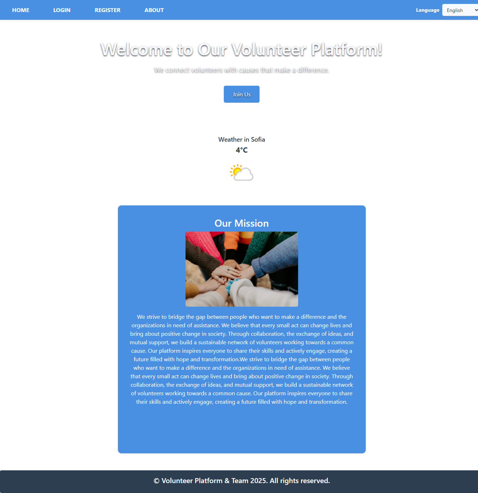
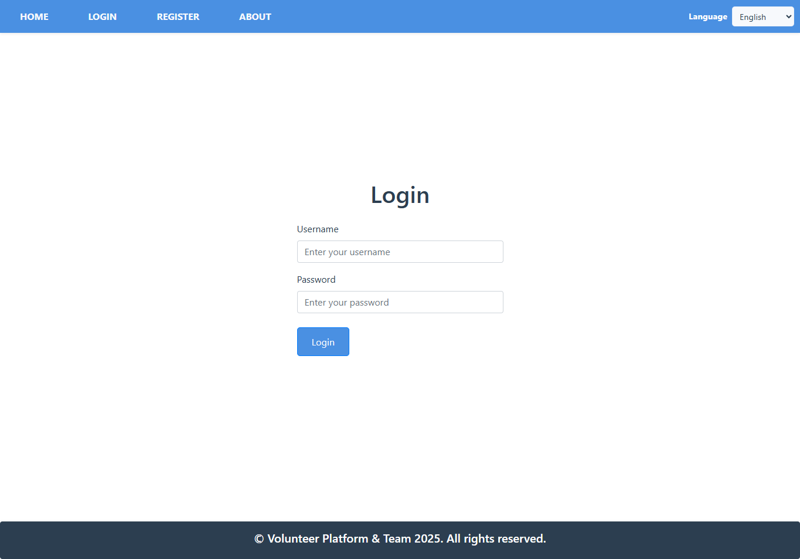
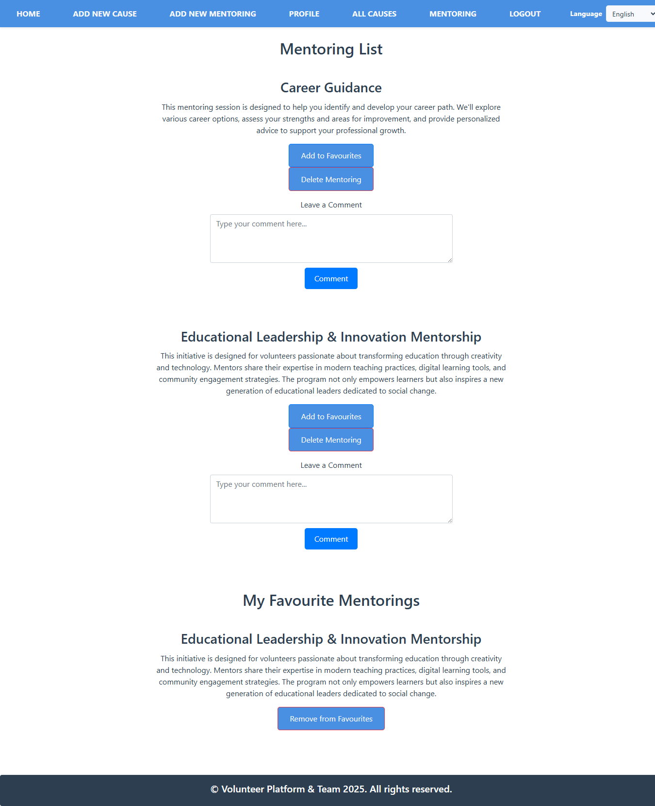
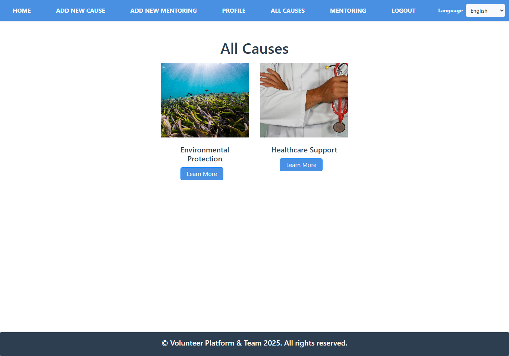
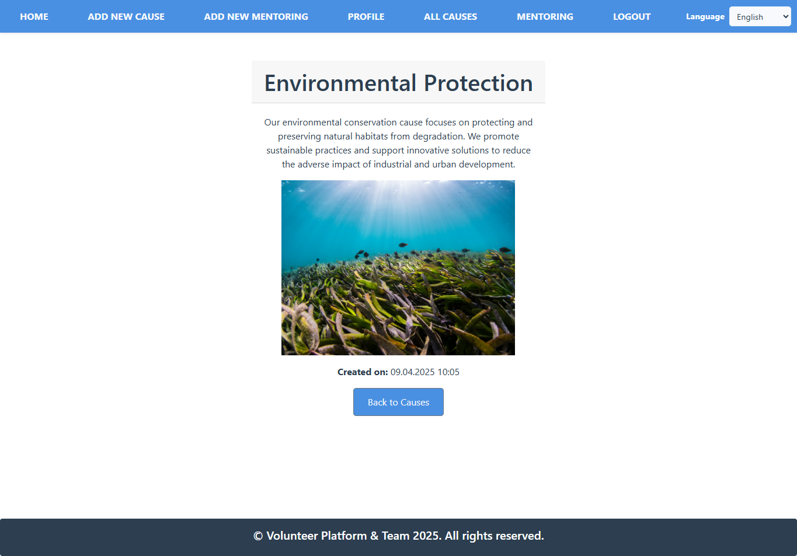
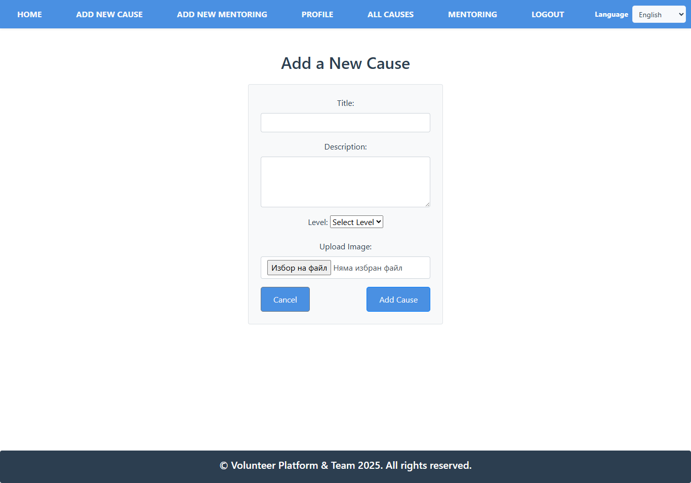
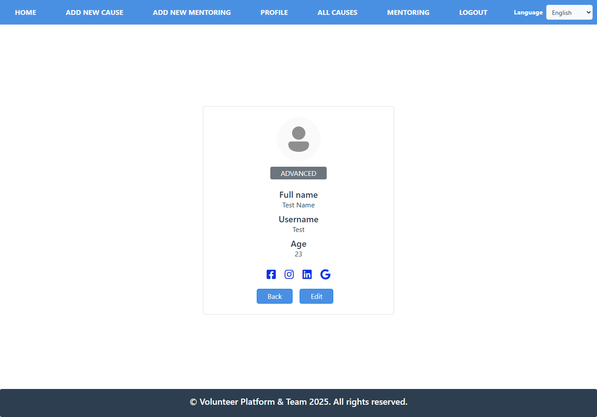
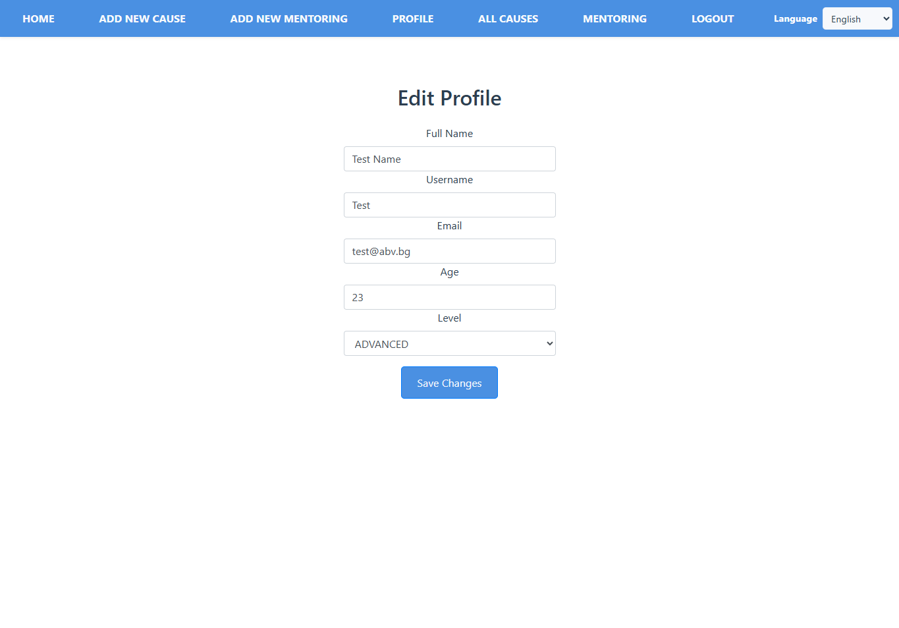
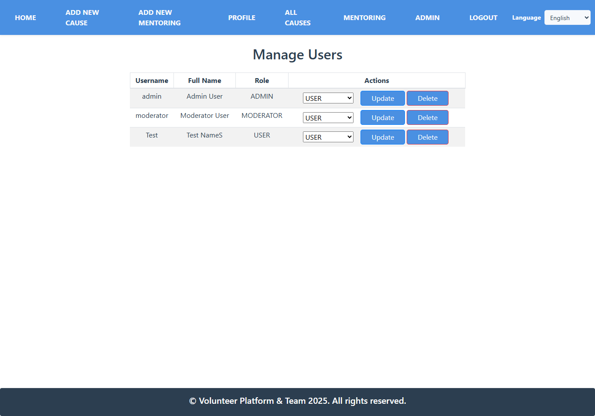

# VolunteerApp

**Final SoftUni Project**  
[Check out the Volunteer Management REST API here](https://github.com/sonyakarafeizova/causes)

A platform that connects volunteers with meaningful causes. Users can register, browse, and contribute to various causes by completing volunteer tasks.  
It provides a space for people to make a difference while tracking their impact.

---

## Table of Contents

- [Overview](#overview)
- [Built With](#built-with)
- [Functionality](#functionality)
  - [For All Users](#for-all-users)
  - [For Not Authenticated Users](#for-not-authenticated-users)
  - [For Authenticated Users](#for-authenticated-users)
  - [For Admins](#for-admins)
- [Admin & User Details](#admin--user-details)
- [Bonuses & Additional Features](#bonuses--additional-features)
- [Screenshots](#screenshots)
- [License](#license)

---

## Overview

VolunteerApp is a platform that enables users to:

- **Discover Volunteer Events:** Browse a variety of volunteer initiatives.  
  *Note: All event ("causes") data is provided by a separate Volunteer Management REST API.*
- **Causes and Mentoring Details:** View comprehensive information about each volunteer event.
- **User Interactions:** Register and comment on mentoring events.
- **Favorites:** Save preferred mentoring.
- **Profile Management:** Users can view and edit their profiles.
- **Admin Features:** Manage user roles and delete causes.

---

## Built With

- **Java 21**
- **Spring Boot**
- **Spring Security**
- **Spring Data JPA**
- **Thymeleaf Template Engine**
- **MySQL**
- **Mockito** (for testing)
- **ModelMapper**
- **Validation & Error Handling**
- **Schedulers**
- **Cloudinary** (for picture uploads)

---

## Functionality

### For All Users

- **About:** Can view info in the about section.
- **Weather:** Display of weather information on the home page.

### For Not Authenticated Users

- **User Registration:** Create an account.
- **Login**

### For Authenticated Users

- **Browse Events:** View all volunteer initiatives.
- **Event Details:** Access detailed information on each event (via the REST API).
- **Add Event:** Create new volunteer events (cause or mentoring).
- **Delete Event:** Remove causes (only available for the administrators).
- **Upload Images:** Add pictures to events (using Cloudinary integration).
- **Comment:** Post and delete comments on mentoring.
- **Favorites:** Add or remove mentoring from your list of favorites.
- **Profile Management:** View and update personal profile details.

### For Admins

- **Role Assignment:** Update user roles.
- **Delete:** Delete causes.

---

## Admin & User Details

Use the following credentials for testing purposes:

- **Admin Details:**
  - **Username:** `admin`
  - **Password:** `admin123`

- **User Details:**
  - **Username:** `Test`
  - **Password:** `12345`

These credentials allow you to explore both administrative functions and regular user functionality.

---

## Bonuses & Additional Features

- **README File**
- **Cloudinary Integration**
- **Internationalization (i18n):** Supports multiple languages on the home page.

---

## Screenshots

### Home Page

### Register and Login

### Volunteer Events List

### Cause Details

### User Profile

### Admin Dashboard

---

## License

This project is licensed under the MIT License.
